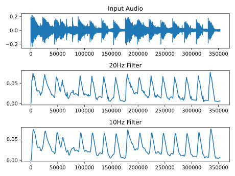
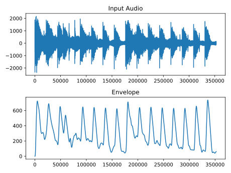

# Envelope Following

Various types of envelope follower are described by Rick Lyons [[1]](https://www.dsprelated.com/showarticle/938.php). At their most basic, they consist of a lowpass filter, which removes the higher frequecy 'carrier' frequencies from a signal to just leave the lower frequecy waveform of the shape the signal makes. This is the same as the decoding of an Amplitude Modulated radio signal. Additionally, the envelope should be entirely positive-valued, so the negative values should be removed by performing half or full-wave rectification. According to the figures provided by Rick Lyons, the latter (asynchronous full-wave envelope detection) provides a smoother output, so this will be attempted.

### Initial, Non-real-time Test (envelope_follower_test.cpp)

My first attempt consists simply of an 'absolute' operation then a lowpass IIR filter [[2]](http://berndporr.github.io/iir1/). This will be tested using a wav imported using the AudioFile module [[3]](https://github.com/adamstark/AudioFile).

The key design element of this envelope follower is the IIR filter. A suitably low cut-off frequency must be selected to remove high-frequency complexities from the signal, but cannot be so low that intricacies of the envelope are lost. Also, a narro transition band will be beneficial.

To subjectively assess the results of different filter cut-off frequencies, the outputs from pseudo-real-time [tests](https://github.com/rt5-tp/envelope_following/blob/main/development/envelope_follower_test.cpp) were output as txt files and [plotted](https://github.com/rt5-tp/envelope_following/blob/main/development/test_data_plotter.py) using the matplotlib.pyplot python library.

    

This plot shows how the envelope follower is working and that a 10Hz cutoff frequency is a suitable choice.

### Real-time Implementation

A [class](https://github.com/rt5-tp/envelope_following/blob/main/src/EnvelopeFollower.cpp) was written to implement the envelope follower algorithm in real-time.

An initial [test](https://github.com/rt5-tp/envelope_following/blob/main/src/test.cpp) of this class was successful:

    

*Note: In order to convert between floating point values read from the input .wav file to short integers, each sample was also multiplied by 10,000. This will expalin the different x-axis values in the plot above.*

## Comments

'AudioFile.h' is used to access the AudioFile module, since there was an issue installing the module properly. It is a direct copy from the AudioFile repository [[3]](https://github.com/adamstark/AudioFile ). 'test-audio.wav' is also borrowed from the AudioFile repository.

# Citations

[1] Lyons, Richard. (2017). Digital Envelope Detection: The Good, the Bad, and the Ugly [Tips and Tricks]. IEEE Signal Processing Magazine. 34. 183-187. 10.1109/MSP.2017.2690438.

[2] http://berndporr.github.io/iir1/

[3] https://github.com/adamstark/AudioFile 
